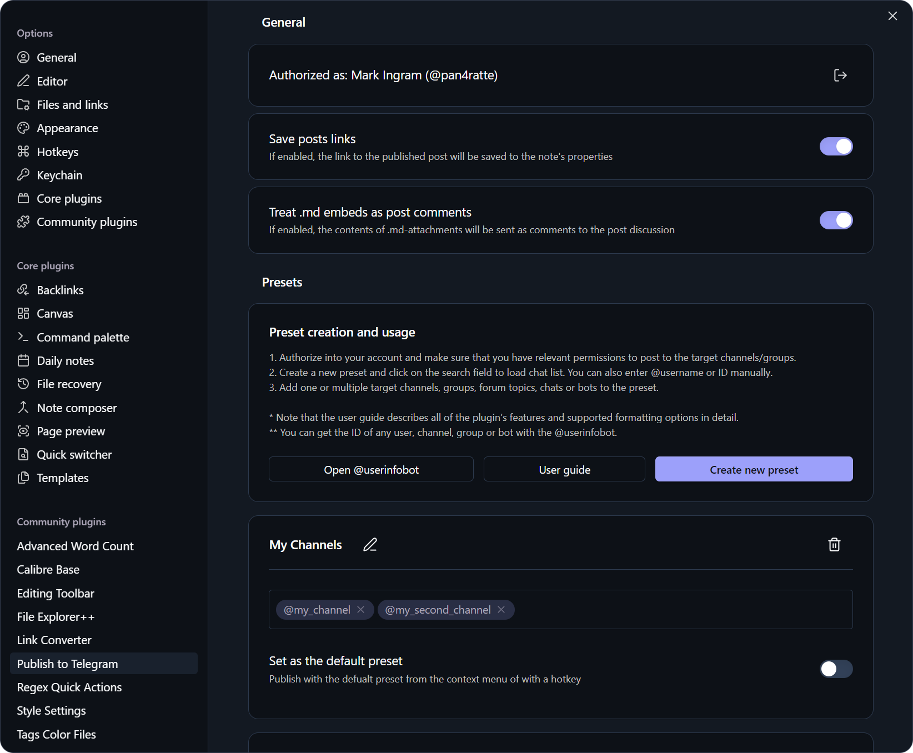

# Publish to Telegram plugin

English | [Русский](https://github.com/pan4ratte/obsidian-publish-to-telegram/blob/main/README_RU.md)

This plugin allows you to post notes directly to Telegram channels, groups and personal messages with different presets. All Telegram formatting options are supported, as well as media and document attachments. Advanced publishing settings are available to schedule posts, send them to multiple channels/groups at once and more.




## Features

1. Create multiple presets to post to different channels, groups and users.

2. Post in different ways: with hotkeys, command palette and context menus.

3. Attach photos, videos, albums and documents to your posts.

4. Advanced publishing settings:

  	* Post to multiple channels/groups at once.
  	* Post without sound.
  	* Post with attached media under the text.
    * Schedule the publication.
    * Edit already existing post.

5. Publish pre-written commentaries to the post discussion (or as replies to the message if it was posted in a group or sent to a user).

6. Set up a default preset to post quickly with it or use command palette or hotkeys.

7. Optionally enable automatic post link saving to the note's properties after publishing.   

8. Publish multiple posts in a row from a single note using a special command that splits the note's text into separate posts.

9. Detailed user guide in the plugin settings with detailed description of all features of the plugin and supported formatting options.


## Installation

### Option 1: Obsidian plugin store

1. In Obsidian settings open the tab "Community plugins" and click "Browse" button.

2. In the search bar type `Publish to Telegram`, click on the result, then "Install" and "Enable" buttons.

Alternatively, you can install the plugin by following the link to the community website: [https://community.obsidian.md/plugins/publish-to-telegram](https://community.obsidian.md/plugins/publish-to-telegram)

### Option 2: BRAT plugin

If you want to test beta-versions of the plugin or use previous versions, you can do that with `BRAT` plugin:

1. Install `BRAT` plugin from the official Obsidian plugin store.

2. In the `BRAT` settings, find the “Beta plugin list” section and click on the “Add beta plugin” button.

3. In the window that appears, paste the link to the `Publish to Telegram` plugin repository: [https://github.com/pan4ratte/obsidian-publish-to-telegram](https://github.com/pan4ratte/obsidian-publish-to-telegram)

4. Under “Select a version” choose the desired version and click the “Add plugin” button. The plugin will be automatically installed and will be ready to use.


## User guide

### Presets

To publish notes to Telegram, you need to configure a preset.

1. In the plugin settings, log in to your account and make sure you have the relevant permissions to post to the target channels/groups. You can use the cloud authorization (phone number only) or provide your own API credentials from [my.telegram.org](https://my.telegram.org).

2. Copy the `@username` of the target channel or user. If the channel is private or you are posting to a group, you will need to get its `ID`. You can get the `ID` of any user, channel, or group with [@userinfobot](https://t.me/userinfobot).

3. Create a new preset and paste the `@username` or `ID` into the “Target channel, group, or user” field.

Now you can post notes to Telegram using your preset’s name via the command palette, the note’s context menu, or keyboard shortcuts.

### Formatting

All standard Telegram formatting elements are supported as well as some additional:

<table>
  <thead>
    <tr>
      <th>Obsidian Input</th>
      <th>Telegram Result</th>
    </tr>
  </thead>
  <tbody>
    <tr>
      <td><code>**Bold**</code></td>
      <td><strong>Bold</strong></td>
    </tr>
    <tr>
      <td><code>*Italic*</code></td>
      <td><em>Italic</em></td>
    </tr>
    <tr>
      <td><code>&lt;u&gt;Underline&lt;/u&gt;</code></td>
      <td><u>Underline</u></td>
    </tr>
    <tr>
      <td><code>~~Strikethrough~~</code></td>
      <td><s>Strikethrough</s></td>
    </tr>
    <tr>
      <td><code>&lt;span class="tg-spoiler"&gt;Spoiler&lt;/span&gt;</code></td>
      <td>Spoiler</td>
    </tr>
    <tr>
      <td><code>`Inline code`</code></td>
      <td><code>Inline code</code></td>
    </tr>
    <tr>
      <td><code>[Link](url)</code></td>
      <td><a href="https://obsidian.md">Link</a></td>
    </tr>
    <tr>
      <td><code>&gt; Quote</code></td>
      <td><blockquote>Quote</blockquote></td>
    </tr>
    <tr>
      <td><codeblock>```<br>Code block<br>```</codeblock></td>
      <td><pre><code>Code block</code></pre></td>
    </tr>
    <tr>
      <td><code>- List</code> or <code>* List</code> or <code>+ List</code></td>
      <td><ul><li>List</li></ul></td>
    </tr>
    <tr>
      <td><code>1. List</code> or <code>1) List</code></td>
      <td>1. List or 1) List</td>
    </tr>
    <tr>
      <td><code># Heading</code></td>
      <td><h5>Heading</h5></td>
    </tr>
    <tr>
      <td><code>---</code> or <code>***</code> or <code>___</code></td>
      <td>───</td>
    </tr>
  </tbody>
</table>

#### Omitting text from a post

In addition to the formatting that will be reflected in the Telegram post, you can use the comment syntax `<!-- hidden text -->` or `%% hidden text %%` to add information to your notes that will not be included in the post content when it is published.

#### Splitting the note into multiple posts

You can also use the special command `<!-- \split -->` or `%% \split %%` to split the text of your note into separate posts. If you use this command, the plugin will publish all posts at the same time. Attachments (see below), including pre-written comments, must appear before the special command that marks the end of the post.

### Attachments

Media, album (groups of media) and document attachments are supported. To attach a file to your post, use any of the standard Obsidian embed syntax options:

`![[some-book-file.pdf]]`

``

`!(some-video-file.mp4)[]`

You can also embed files with external web-link embeds:

``

Currently supported formats:

| Extension                                          | Attachment type |
| -------------------------------------------------- | --------------- |
| `.jpg`, `.jpeg`, `.png`, `.webp` 		             	 | Photo / Album   |
| `.gif`                                             | Animation       |
| `.mp4`, `.mov`, `.avi`, `.mkv`, `.webm`            | Video / Album   |
| `.pdf`                                             | Document        |

### Pre-written comments

You can pre-write one or more comments for your post that will appear in its discussion right after the publication. To use that feature:

1. In the plugin settings turn on the option "Treat .md embeds as post comments".

2. To prepare a comment for a post, use the `![[comment-file]]` embed syntax. Only files with the .md extension are treated comments.

A couple of notes:

* If a comment on a post is published in a group or in personal messages, it will appear as a regular reply to a message.

* If you split the note into multiple posts (see above), you can attach the comments to each of the posts. To do that, place .md-embeds before the corresponding marker.  

* Note that all comments are published with a slight delay.

### Advanced publishing settings

You can open an advanced publishing settings window with command palette (`Ctrl + P`) by typing "Publish to Telegram: Publish with advanced settings". In that settings window you can choose to:

* Post to multiple channels/groups at once.
* Post without sound.
* Post with attached media under the text.
* Schedule the publication.
* Edit already existing post. Links to the posts are stored in the `telegram_links` property, which is filled automatically if the corresponding option is enabled in the settings. You can also create it and fill manually.

### Limits

Standard Telegram posting limits apply to limits of characters per post, limits of attached media size per post, etc. More about that: [https://limits.tginfo.me/](https://limits.tginfo.me/)

I also highly recommend my other plugin, [Advanced Word Count](https://community.obsidian.md/plugins/advanced-word-count), which lets you create detailed presets for word counts in notes and offers significantly greater functionality compared to the standard Obsidian word counter. This plugin can be configured to count characters exactly the same way Telegram does.

## About the Author

My name is Mark Ingram (Ingrem), I am a Religious Studies scholar. Apart from my main area of study (Protestant Political Theology in Russia), I teach the subject "Information Technologies in Scientific Research", a unique course that I developed myself from scratch. This plugin helps me in my studies and I use it in my teaching, as well as other plugins that I develop and that you can find on [my GitHub profile](https://github.com/pan4ratte/).

Hello to every student that came across this page!

Huge thanks to [Egor Gvozdikov](https://github.com/egorgvo), who wrote the first lines of code for this project and made numerous valuable commits.
